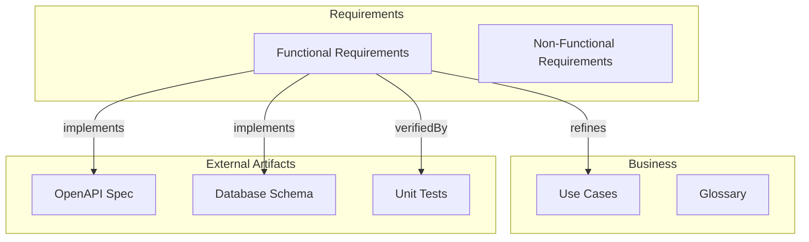

# speckeeper

[](https://www.npmjs.com/package/speckeeper)
[](https://opensource.org/licenses/MIT)
[](https://nodejs.org)

**TypeScript-first specification validation framework** — validate design consistency and external SSOT integrity with full traceability.

## Why speckeeper?

Requirements and design documents often drift from implementation. **speckeeper** treats specifications as **code** — type-safe, version-controlled, and continuously validated against your actual artifacts (tests, OpenAPI, DDL, IaC).

```
speckeeper.config.ts (sources)
    │
    ├─► Global Source Scan  → Find spec IDs in OpenAPI / DDL / annotations
    │         │
    │         ▼
    │    MatchMap (specId → matches)
    │         │
    │         ▼
    ├─► Deep Validation     → Model-level structural checks (optional)
    │
design/*.ts
    │
    ├─► speckeeper lint     → Design integrity (IDs, references, phase gates)
    ├─► speckeeper check    → External SSOT validation (global scan + deep validation)
    └─► speckeeper impact   → Change impact analysis with traceability
```

## Features

- **TypeScript as SSOT** — Define requirements, architecture, and design in type-safe TypeScript
- **Design validation** — Lint rules for ID uniqueness, reference integrity, circular dependencies, and phase gates
- **External SSOT validation** — Global scan across OpenAPI, DDL, annotations; optional deep validation per model
- **Traceability** — Track relationships across model levels (L0-L3) with impact analysis
- **Scaffold from Mermaid** — Generate `_models/` skeletons from a mermaid flowchart with class-based artifact resolution
- **Custom models** — Extend with domain-specific models (Runbooks, Policies, etc.)
- **CI-ready** — Built-in lint, drift detection, and coverage checks

## Installation

```bash
npm install speckeeper

# Verify installation
npx speckeeper --help
```

## Quick Start

### 1. Define your metamodel as a Mermaid flowchart

Create a Markdown file (e.g. `requirements.md`) containing a mermaid flowchart that describes the relationships between your specification entities:



Key concepts:
- `class ... speckeeper` marks nodes as managed by speckeeper
- Additional `class` lines assign **artifact classes** (determines model name/file and node grouping)
- External node classes (`openapi`, `sqlschema`, `test`) describe the artifact type
- `subgraph` determines model level (L0–L3)
- `implements`/`verifiedBy` edges define the relationship semantics

### 2. Scaffold models

```bash
npx speckeeper scaffold --source requirements.md
```

This generates:
- `design/_models/` — Model classes with base schema and lint rules
- `design/*.ts` — Spec data files using `defineSpecs()`
- `design/index.ts` — Entry point via `mergeSpecs()`

See [Scaffold Mermaid Specification](./docs/scaffold-mermaid-spec.md) for the full input format.

### 3. Fill in your specifications

Edit spec data files in `design/` to add your actual specification data. Each file uses `defineSpecs()` to pair Model instances with data:

```typescript
// design/requirements.ts
import { defineSpecs } from 'speckeeper';
import type { Requirement } from './_models/requirement';
import { FunctionalRequirementModel } from './_models/requirement';

const requirements: Requirement[] = [
  {
    id: 'FR-001',
    name: 'User Authentication',
    type: 'functional',
    description: 'Users can authenticate using email and password',
    priority: 'must',
    acceptanceCriteria: [
      { id: 'FR-001-01', description: 'Valid credentials grant access', verificationMethod: 'test' },
      { id: 'FR-001-02', description: 'Invalid credentials show error', verificationMethod: 'test' },
    ],
  },
];

export default defineSpecs(
  [FunctionalRequirementModel.instance, requirements],
);
```

`design/index.ts` aggregates all spec files, and `speckeeper.config.ts` imports the result — no manual wiring needed beyond adding your spec file to `design/index.ts`.

### 4. Run validation

```bash
# Validate design integrity
npx speckeeper lint

# Check test coverage against requirements
npx speckeeper check test --coverage

# Analyze change impact
npx speckeeper impact FR-001
```

> **Alternative**: `npx speckeeper init` creates a minimal project with generic starter templates. Use this if you prefer to build models from scratch. See [Model Definition Guide](./docs/model-guide.md) for details.

## CLI Commands

| Command | Description |
|---------|-------------|
| `speckeeper init` | Initialize a new project with starter templates |
| `speckeeper lint` | Validate design integrity (ID uniqueness, references, phase gates) |
| `speckeeper check` | Verify consistency with external SSOT |
| `speckeeper check test --coverage` | Verify test coverage for requirements |
| `speckeeper scaffold` | Generate model skeletons from a mermaid flowchart |
| `speckeeper drift` | Detect manual edits to generated `docs/` files |
| `speckeeper impact <id>` | Analyze change impact for a specific element |

**Note**: `speckeeper build` generates machine-readable `specs/` output. For human-readable docs (`docs/`), use [embedoc](https://www.npmjs.com/package/embedoc) or similar tools with the model rendering API.

## Validation Features

### Design Integrity (lint)

```bash
$ npx speckeeper lint

speckeeper lint

  Design: design/
  Loaded: 17 files

  Running lint checks...

  ✓ No issues found
```

Checks include:
- **ID uniqueness** — No duplicate IDs within model types
- **ID conventions** — Enforce naming patterns (e.g., `FR-001`, `COMP-AUTH`)
- **Reference integrity** — All referenced IDs must exist
- **Circular dependency detection** — Prevent reference loops
- **Phase gates** — Ensure TBD items are resolved by target phase
- **Custom lint rules** — Define model-specific validation

### External SSOT Validation (check)

Validate your specifications against actual implementation artifacts. speckeeper performs a **global source scan** across all configured sources, then optionally runs **deep validation** using model-specific rules.

The check flow has three levels:

1. **Existence check** (automatic) — Is the spec ID found in any configured source?
2. **Structural check** (via `deepValidation`) — Does the matched object's structure match? (e.g. HTTP method, table columns)
3. **Type check** (via `deepValidation`) — Do types match? (e.g. parameter types, column types)

#### Source configuration

Define global scan sources in `speckeeper.config.ts`:

```typescript
// speckeeper.config.ts
import { defineConfig } from 'speckeeper';

export default defineConfig({
  // ...
  sources: [
    {
      type: 'openapi',
      paths: ['api/openapi.yaml'],
      relation: 'implements',
    },
    {
      type: 'ddl',
      paths: ['db/schema.sql'],
      relation: 'implements',
    },
    {
      type: 'annotation',
      paths: ['test/**/*.test.ts', 'tests/**/*.test.ts'],
      relation: 'verifiedBy',
    },
    {
      type: 'annotation',
      paths: ['src/**/*.ts'],
      exclude: ['src/**/*.test.ts'],
      relation: 'implements',
    },
  ],
});
```

Each source defines:
- **`type`** — Built-in (`'openapi'`, `'ddl'`, `'annotation'`) or custom with a `scanner` plugin
- **`paths`** — Glob patterns for files to scan
- **`relation`** — Whether matches represent `'implements'` or `'verifiedBy'`

#### Built-in scanners

| Scanner | Finds spec IDs via | Deep validation |
|---------|-------------------|-----------------|
| `openapi` | operationId, path segment, schema name, `x-spec-id` | HTTP method, parameter names/types, response property names/types |
| `ddl` | Table name (case-insensitive, schema-prefix stripped) | Column names, column types (containment-based) |
| `annotation` | `@verifies`, `@implements`, `@traces` annotations | — |

Annotations work in any comment style (`//`, `#`, `--`, `/* */`, `<!-- -->`). Multiple IDs can be comma- or space-separated.

```typescript
// tests/unit/auth.test.ts
// @verifies FR-001, FR-001-01
describe('User Authentication', () => { ... });
```

```typescript
// src/auth/handler.ts
// @implements FR-001
export class AuthHandler { ... }
```

#### Deep validation (optional)

Models can define `deepValidation` to enable Level 2/3 structural checks on matched source objects:

```typescript
class EntityModel extends Model<typeof EntitySchema> {
  // ... schema, lintRules, etc.

  protected deepValidation: DeepValidationConfig<Entity> = {
    ddl: {
      mapper: (spec) => ({
        tableName: spec.tableName,
        columns: spec.columns.map(c => ({ name: c.name, type: c.type })),
        checkTypes: true,
      }),
    },
    openapi: {
      mapper: (spec) => ({
        path: spec.apiPath,
        method: spec.httpMethod,
        responseProperties: spec.fields.map(f => ({ name: f.name, type: f.type })),
      }),
    },
  };
}
```

Without `deepValidation`, speckeeper still performs existence checks for all spec IDs across all configured sources.

#### Custom scanners

For file formats not covered by the built-in scanners, provide a custom `SourceScanner` plugin:

```typescript
// speckeeper.config.ts
import { defineConfig } from 'speckeeper';
import type { SourceScanner } from 'speckeeper';

const protoScanner: SourceScanner = {
  findSpecIds(content, specIds, filePath) {
    // Parse protobuf content, find spec IDs in service/message names
    // Return SourceMatch[] with specId, location, and optional context
    return [];
  },
};

export default defineConfig({
  sources: [
    { type: 'proto', paths: ['proto/**/*.proto'], relation: 'implements', scanner: protoScanner },
    // ... other sources
  ],
});
```

```bash
$ npx speckeeper check --verbose

speckeeper check

  Design: design/
  Type:   all

  ✓ All checks passed
```

## Model Levels & Traceability

speckeeper organizes models by abstraction level:

| Level | Focus | Examples |
|-------|-------|----------|
| **L0** | Business + Domain (Why) | UseCase, Actor, Term |
| **L1** | Requirements (What) | Requirement, Constraint |
| **L2** | Design (How) | Component, Entity, Layer |
| **L3** | Implementation (Build) | Screen, APIRef, TableRef |

Relations between models enable **impact analysis**:

```bash
$ npx speckeeper impact FR-001

FR-001 (Requirement)
├── implements: COMP-AUTH (Component)
├── satisfies: UC-001 (UseCase)
└── verifiedBy: TEST-001 (TestRef)
```

### Relation Types

| Relation | Direction | Description |
|----------|-----------|-------------|
| `implements` | spec→external | Spec is implemented as external artifact (OpenAPI, DDL) |
| `verifiedBy` | spec→test | Spec is verified by external test code |
| `satisfies` | L1→L0 | Satisfies a use case |
| `refines` | Same level or lower | Refinement |
| `verifies` | test→implementation | Test verifies implementation code (external, no checker) |
| `dependsOn` | None | Dependency |
| `relatedTo` | None | Association |

See [Model Entity Catalog](./docs/model_entity_catalog.md) for full details on relation types and level constraints.

## Customizing Models

Scaffolded models provide a base schema (id, name, description, relations). You can customize them or add new domain-specific models using core factory functions from `speckeeper/dsl`:

```typescript
import { z } from 'zod';
import { Model, RelationSchema } from 'speckeeper';
import type { LintRule, Exporter, ModelLevel } from 'speckeeper';
import { requireField, arrayMinLength } from 'speckeeper/dsl';

const RunbookSchema = z.object({
  id: z.string(),
  name: z.string().min(1),
  description: z.string(),
  severity: z.enum(['critical', 'high', 'medium', 'low']),
  steps: z.array(z.object({
    action: z.string(),
    verification: z.string().optional(),
  })).min(1),
  relations: z.array(RelationSchema).optional(),
});

type Runbook = z.input<typeof RunbookSchema>;

class RunbookModel extends Model<typeof RunbookSchema> {
  readonly id = 'runbook';
  readonly name = 'Runbook';
  readonly idPrefix = 'RB';
  readonly schema = RunbookSchema;
  readonly description = 'Incident runbooks';
  protected modelLevel: ModelLevel = 'L3';

  protected lintRules: LintRule<Runbook>[] = [
    requireField<Runbook>('description', 'error'),
    arrayMinLength<Runbook>('steps', 1),
  ];

  protected exporters: Exporter<Runbook>[] = [];
}
```

Core DSL factories (`speckeeper/dsl`) include `requireField`, `arrayMinLength`, `idFormat`, `childIdFormat`, `markdownExporter`, `annotationCoverage`, `relationCoverage`, and `baseSpecSchema`. Global scanner utilities (`openapiScanner`, `ddlScanner`, `annotationScanner`, `createAnnotationScanner`) are also re-exported for advanced use.

## Documentation

- **[Model Definition Guide](./docs/model-guide.md)** — Start here for model customization and API reference
- [Framework Requirements Specification](./docs/framework_requirements_spec.md) — Detailed feature specifications
- [Model Entity Catalog](./docs/model_entity_catalog.md) — Model hierarchy and relation types

## Compatibility

- Node.js >= 20.0.0
- TypeScript >= 5.0

## Contributing

```bash
# Install dependencies
npm install

# Run tests
npm test

# Lint
npm run lint
npm run lint:design

# Full CI check
npm run ci
```

## License

MIT
