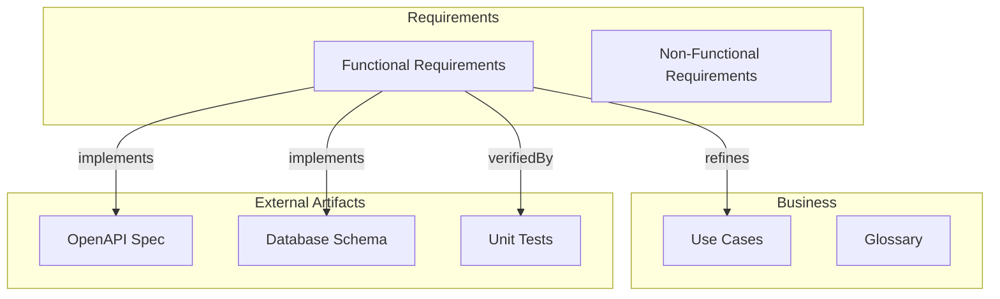

# speckeeper

[](https://www.npmjs.com/package/speckeeper)
[](https://opensource.org/licenses/MIT)
[](https://nodejs.org)

**TypeScript-first specification validation framework** — validate design consistency and external SSOT integrity with full traceability.

## Why speckeeper?

Requirements and design documents often drift from implementation. **speckeeper** treats specifications as **code** — type-safe, version-controlled, and continuously validated against your actual artifacts (tests, OpenAPI, DDL, IaC).

```
Mermaid flowchart ──► speckeeper scaffold ──► design/_models/
                                                     │
design/*.ts  ─────────────────────────────► Validation & Consistency Checks
    │
    ├─► speckeeper lint    → Design integrity (IDs, references, phase gates)
    ├─► speckeeper check   → External SSOT validation (test coverage, etc.)
    └─► speckeeper impact  → Change impact analysis with traceability
```

## Features

- **TypeScript as SSOT** — Define requirements, architecture, and design in type-safe TypeScript
- **Design validation** — Lint rules for ID uniqueness, reference integrity, circular dependencies, and phase gates
- **External SSOT validation** — Check consistency with test files, and custom checkers for OpenAPI, DDL, etc.
- **Traceability** — Track relationships across model levels (L0-L3) with impact analysis
- **Scaffold from Mermaid** — Generate `_models/` skeletons from a mermaid flowchart with class-based artifact resolution
- **Custom models** — Extend with domain-specific models (Runbooks, Policies, etc.)
- **CI-ready** — Built-in lint, drift detection, and coverage checks

## Installation

```bash
npm install speckeeper

# Verify installation
npx speckeeper --help
```

## Quick Start

### 1. Define your metamodel as a Mermaid flowchart

Create a Markdown file (e.g. `requirements.md`) containing a mermaid flowchart that describes the relationships between your specification entities:



Key concepts:
- `class ... speckeeper` marks nodes as managed by speckeeper
- Additional `class` lines assign **artifact classes** (determines model name/file and node grouping)
- External node classes (`openapi`, `sqlschema`, `test`) determine checker bindings
- `subgraph` determines model level (L0–L3)
- `implements` edges trigger external SSOT validation
- `verifiedBy` edges trigger test verification

### 2. Scaffold models

```bash
npx speckeeper scaffold --source requirements.md
```

This generates:
- `design/_models/` — Model classes with base schema, lint rules, and `annotationChecker` bindings derived from `implements`/`verifiedBy` edges
- `design/*.ts` — Spec data files using `defineSpecs()`
- `design/index.ts` — Entry point via `mergeSpecs()`

See [Scaffold Mermaid Specification](./docs/scaffold-mermaid-spec.md) for the full input format.

### 3. Fill in your specifications

Edit spec data files in `design/` to add your actual specification data. Each file uses `defineSpecs()` to pair Model instances with data:

```typescript
// design/requirements.ts
import { defineSpecs } from 'speckeeper';
import type { Requirement } from './_models/requirement';
import { FunctionalRequirementModel } from './_models/requirement';

const requirements: Requirement[] = [
  {
    id: 'FR-001',
    name: 'User Authentication',
    type: 'functional',
    description: 'Users can authenticate using email and password',
    priority: 'must',
    acceptanceCriteria: [
      { id: 'FR-001-01', description: 'Valid credentials grant access', verificationMethod: 'test' },
      { id: 'FR-001-02', description: 'Invalid credentials show error', verificationMethod: 'test' },
    ],
  },
];

export default defineSpecs(
  [FunctionalRequirementModel.instance, requirements],
);
```

`design/index.ts` aggregates all spec files, and `speckeeper.config.ts` imports the result — no manual wiring needed beyond adding your spec file to `design/index.ts`.

### 4. Run validation

```bash
# Validate design integrity
npx speckeeper lint

# Check test coverage against requirements
npx speckeeper check test --coverage

# Analyze change impact
npx speckeeper impact FR-001
```

> **Alternative**: `npx speckeeper init` creates a minimal project with generic starter templates. Use this if you prefer to build models from scratch. See [Model Definition Guide](./docs/model-guide.md) for details.

## CLI Commands

| Command | Description |
|---------|-------------|
| `speckeeper init` | Initialize a new project with starter templates |
| `speckeeper lint` | Validate design integrity (ID uniqueness, references, phase gates) |
| `speckeeper check` | Verify consistency with external SSOT |
| `speckeeper check test --coverage` | Verify test coverage for requirements |
| `speckeeper scaffold` | Generate model skeletons from a mermaid flowchart |
| `speckeeper drift` | Detect manual edits to generated `docs/` files |
| `speckeeper impact <id>` | Analyze change impact for a specific element |

**Note**: `speckeeper build` generates machine-readable `specs/` output. For human-readable docs (`docs/`), use [embedoc](https://www.npmjs.com/package/embedoc) or similar tools with the model rendering API.

## Validation Features

### Design Integrity (lint)

```bash
$ npx speckeeper lint

speckeeper lint

  Design: design/
  Loaded: 17 files

  Running lint checks...

  ✓ No issues found
```

Checks include:
- **ID uniqueness** — No duplicate IDs within model types
- **ID conventions** — Enforce naming patterns (e.g., `FR-001`, `COMP-AUTH`)
- **Reference integrity** — All referenced IDs must exist
- **Circular dependency detection** — Prevent reference loops
- **Phase gates** — Ensure TBD items are resolved by target phase
- **Custom lint rules** — Define model-specific validation

### External SSOT Validation (check)

Validate your specifications against actual implementation artifacts. speckeeper scans source and test files for **annotation comments** (`@verifies`, `@implements`, `@traces`) to automatically detect which specs are covered — no manual relation wiring needed.

#### Annotation-based auto-detection

Add annotations to your source and test files:

```typescript
// tests/unit/auth.test.ts
// @verifies FR-001, FR-001-01
describe('User Authentication', () => { ... });
```

```typescript
// src/auth/handler.ts
// @implements FR-001
export class AuthHandler { ... }
```

speckeeper scans for these annotations and automatically links specs to their implementation and tests. Annotations work in any comment style (`//`, `#`, `--`, `/* */`, `<!-- -->`).

#### Artifact configuration

Define scan targets per artifact class in your config:

```typescript
// speckeeper.config.ts
export default defineConfig({
  // ...
  artifacts: {
    test: {
      globs: ['test/**/*.test.ts', 'tests/**/*.test.ts'],
      contentPatterns: [/@verifies\s+([\w-]+(?:[,\s]+[\w-]+)*)/],
    },
    typescript: {
      globs: ['src/**/*.ts'],
      exclude: ['src/**/*.test.ts', 'src/**/*.d.ts'],
      contentPatterns: [/@implements\s+([\w-]+(?:[,\s]+[\w-]+)*)/],
    },
    openapi: {
      globs: ['api/openapi.yaml'],
    },
  },
});
```

Scaffold auto-generates this config based on your Mermaid flowchart's external nodes and their artifact classes.

#### Checker factories

| Factory | Type | Validates |
|---------|------|-----------|
| `annotationChecker()` | Generic | Scans files for `@verifies`/`@implements`/`@traces` annotations matching spec IDs |
| `annotationCoverage()` | Coverage | Computes coverage from annotation scan results (no manual relations needed) |
| `externalOpenAPIChecker()` | Specialized | OpenAPI spec: operationId, path, schema, x-spec-id, HTTP method, parameter/response types |
| `externalSqlSchemaChecker()` | Specialized | SQL schema: table existence, column existence, type containment |

`annotationChecker()` is the generic checker. Specialized checkers (`externalOpenAPIChecker`, `externalSqlSchemaChecker`) extend it with source-level parsing for deeper validation. Scaffold generates the appropriate checker binding based on your artifact classes.

```typescript
// design/_models/requirement.ts
import { annotationChecker } from 'speckeeper/dsl';

class RequirementModel extends Model<typeof RequirementSchema> {
  // ... schema, lintRules, etc.

  protected externalChecker = annotationChecker<Requirement>({
    checks: [
      { artifact: 'test', relationType: 'verifiedBy' },
      { artifact: 'typescript', relationType: 'implements' },
    ],
  });
}
```

```bash
$ npx speckeeper check test --coverage

speckeeper check

  Design: design/
  Type:   test

  Scanning artifacts...
    test:       12 @verifies annotations in 8 files
    typescript:  5 @implements annotations in 4 files

  ✓ All checks passed

  Coverage: Requirement (verifiedBy → test)
    Coverage: 100% (7/7 requirements verified)
```

You can also implement custom checkers for any external source by defining an `ExternalChecker<T>` directly. See [Model Definition Guide](./docs/model-guide.md) for details.

## Model Levels & Traceability

speckeeper organizes models by abstraction level:

| Level | Focus | Examples |
|-------|-------|----------|
| **L0** | Business + Domain (Why) | UseCase, Actor, Term |
| **L1** | Requirements (What) | Requirement, Constraint |
| **L2** | Design (How) | Component, Entity, Layer |
| **L3** | Implementation (Build) | Screen, APIRef, TableRef |

Relations between models enable **impact analysis**:

```bash
$ npx speckeeper impact FR-001

FR-001 (Requirement)
├── implements: COMP-AUTH (Component)
├── satisfies: UC-001 (UseCase)
└── verifiedBy: TEST-001 (TestRef)
```

### Relation Types

| Relation | Direction | Description |
|----------|-----------|-------------|
| `implements` | spec→external | Spec is implemented as external artifact (OpenAPI, DDL) |
| `verifiedBy` | spec→test | Spec is verified by external test code |
| `satisfies` | L1→L0 | Satisfies a use case |
| `refines` | Same level or lower | Refinement |
| `verifies` | test→implementation | Test verifies implementation code (external, no checker) |
| `dependsOn` | None | Dependency |
| `relatedTo` | None | Association |

See [Model Entity Catalog](./docs/model_entity_catalog.md) for full details on relation types and level constraints.

## Customizing Models

Scaffolded models provide a base schema (id, name, description, relations). You can customize them or add new domain-specific models using core factory functions from `speckeeper/dsl`:

```typescript
import { z } from 'zod';
import { Model, RelationSchema } from 'speckeeper';
import type { LintRule, Exporter, ModelLevel } from 'speckeeper';
import { requireField, arrayMinLength } from 'speckeeper/dsl';

const RunbookSchema = z.object({
  id: z.string(),
  name: z.string().min(1),
  description: z.string(),
  severity: z.enum(['critical', 'high', 'medium', 'low']),
  steps: z.array(z.object({
    action: z.string(),
    verification: z.string().optional(),
  })).min(1),
  relations: z.array(RelationSchema).optional(),
});

type Runbook = z.input<typeof RunbookSchema>;

class RunbookModel extends Model<typeof RunbookSchema> {
  readonly id = 'runbook';
  readonly name = 'Runbook';
  readonly idPrefix = 'RB';
  readonly schema = RunbookSchema;
  readonly description = 'Incident runbooks';
  protected modelLevel: ModelLevel = 'L3';

  protected lintRules: LintRule<Runbook>[] = [
    requireField<Runbook>('description', 'error'),
    arrayMinLength<Runbook>('steps', 1),
  ];

  protected exporters: Exporter<Runbook>[] = [];
}
```

Core DSL factories (`speckeeper/dsl`) include `requireField`, `arrayMinLength`, `idFormat`, `childIdFormat`, `markdownExporter`, `annotationChecker`, `annotationCoverage`, `externalOpenAPIChecker`, `externalSqlSchemaChecker`, `relationCoverage`, and `baseSpecSchema`.

## Documentation

- **[Model Definition Guide](./docs/model-guide.md)** — Start here for model customization and API reference
- [Framework Requirements Specification](./docs/framework_requirements_spec.md) — Detailed feature specifications
- [Model Entity Catalog](./docs/model_entity_catalog.md) — Model hierarchy and relation types

## Compatibility

- Node.js >= 20.0.0
- TypeScript >= 5.0

## Contributing

```bash
# Install dependencies
npm install

# Run tests
npm test

# Lint
npm run lint
npm run lint:design

# Full CI check
npm run ci
```

## License

MIT
