# speckeeper scaffold: mermaid 入力仕様

`speckeeper scaffold` コマンドは、mermaid flowchart で記述された仕様メタモデルを入力として、speckeeper の `design/_models/` および `design/_checkers/` のスケルトンコードを自動生成する。

本ドキュメントは、scaffold が受け付ける mermaid flowchart の書式・制約・語彙を定義する。

---

## 1. 全体構造

scaffold が処理する Markdown ファイルには、1 つ以上の mermaid コードブロックを含める。scaffold は最初に見つかった `flowchart` ブロックを処理対象とする。

    ```mermaid
    flowchart TB
      ノード定義
      エッジ定義
      classDef / class 定義
    ```

- `flowchart` の方向指定（`TB`, `LR` 等）は任意。scaffold の動作には影響しない。
- `graph` キーワードも `flowchart` と同等に扱う。
- `%%` で始まる行はコメントとして無視される。

---

## 2. ノード定義

### 2.1 書式

```
ID[ラベル]
```

| 要素 | 必須 | 説明 |
|------|------|------|
| `ID` | 必須 | 英数字とアンダースコアで構成。先頭は英字またはアンダースコア |
| `[ラベル]` | 任意 | 角括弧で囲んだ表示テキスト。日本語可。省略時は ID がラベルとなる |

### 2.2 ノードの出現場所

ノードはエッジ定義の中で初出してもよい。同じ ID のノードが複数回出現した場合、最初にラベルが付与された定義が採用される。

```
SR -->|refines| FR[機能要求]   %% FR のラベルはここで定義
FR -->|includes| AT[受入基準]  %% FR は既に定義済み、ラベル無視
```

### 2.3 ビルトインノード ID

以下のノード ID は、scaffold が特定のモデルテンプレートにマッピングする予約 ID である。

| ノード ID | テンプレート | Model 名 | ID Prefix | Level | 説明 |
|-----------|-------------|----------|-----------|-------|------|
| `TERM` | term | Term | TERM | L0 | 用語（グロッサリー） |
| `CDM` | entity | ConceptualDataModel | CDM | L0 | 概念データモデル |
| `SR` | requirement | SystemRequirement | SR | L1 | システム要求 |
| `FR` | requirement | FunctionalRequirement | FR | L1 | 機能要求 |
| `NFR` | requirement | NonFunctionalRequirement | NFR | L1 | 非機能要求 |
| `UC` | usecase | UseCase | UC | L1 | ユースケース |
| `LDM` | logical-entity | LogicalDataModel | LDM | L2 | 論理データモデル |
| `AT` | acceptance-test | AcceptanceTest | AT | L2 | 受入基準 |
| `DT` | data-test | DataTest | DT | L2 | データ整合性テスト仕様 |
| `VC` | validation-constraint | ValidationConstraint | VC | L2 | バリデーション制約 |

同じテンプレートにマッピングされるノード ID（SR, FR, NFR → requirement）は、1 つのモデルファイルに集約される（1ファイル内に複数の Model クラスを定義）。

ビルトイン ID に該当しないノードは `base` テンプレート（id, name, description, relations のみの最小構成）にフォールバックする。

---

## 3. speckeeper 管理ノードの宣言

scaffold が `_models/*.ts` を生成する対象は、`classDef` + `class` で **speckeeper 管理** と明示されたノードのみである。

### 3.1 書式

```
classDef speckeeper fill:#2563EB,stroke:#1D4ED8,color:#fff,stroke-width:2px
class TERM,SR,FR,NFR,CDM,UC,LDM,AT,DT,VC speckeeper
```

| 行 | 必須 | 説明 |
|----|------|------|
| `classDef speckeeper ...` | 必須 | CSS スタイル定義。スタイル値は自由 |
| `class ID1,ID2,... speckeeper` | 必須 | speckeeper 管理するノード ID をカンマ区切りで列挙 |

- クラス名は `speckeeper` 固定。scaffold はこのクラス名でフィルタリングする。
- `class` 行に列挙されていないノードは「外部ノード」として扱われ、モデルファイルは生成されない。
- 外部ノードへのエッジがある場合、そのエッジのラベルに応じてチェッカーファイルが生成される。

---

## 4. エッジ定義

### 4.1 書式

```
SourceID -->|ラベル| TargetID[ラベル]
SourceID <-->|ラベル| TargetID[ラベル]
```

| 矢印 | 名前 | 方向 |
|-------|------|------|
| `-->` | 単方向 | forward |
| `<-->` | 双方向 | bidirectional |
| `--->`, `---->` | 単方向（長い） | forward |
| `<--->`, `<---->` | 双方向（長い） | bidirectional |
| `-.->` | 点線・単方向 | forward |
| `==>` | 太線・単方向 | forward |

ラベル（`|...|`）は任意だが、scaffold はラベルに基づいて生成コードの種別を決定するため、**ラベルの付与を強く推奨する**。ラベルのないエッジは scaffold の生成対象外となる。

---

## 5. エッジラベル仕様

### 5.1 基本ルール

speckeeper 管理ノードを含むエッジ（source または target の少なくとも一方が speckeeper 管理）のラベルは、**speckeeper の `RELATION_TYPES` と一致する文字列**でなければならない。

**speckeeper 管理外のノード同士** のエッジラベルは自由（任意のテキストを使用可能）。

### 5.2 使用可能なラベル（= speckeeper RELATION_TYPES）

speckeeper 管理ノードを含むエッジで使用可能なラベル 7 種と、scaffold が生成するコードの対応:

**カテゴリ A: speckeeper lint 対象（speckeeper ↔ speckeeper 参照整合性）**

| ラベル | 矢印 | scaffold が生成するもの | 説明 |
|--------|-------|----------------------|------|
| `refines` | `-->` | lintRule（参照存在・level 制約チェック） | 上位項目を下位項目に詳細化する |
| `relatedTo` | `<-->` | lintRule（双方向の参照存在チェック） | 双方向の関連・一貫性制約 |
| `uses` | `-->` | lintRule（参照先存在チェック） | 参照・依存関係 |
| `dependsOn` | `-->` | lintRule（依存先存在チェック） | 依存関係 |
| `satisfies` | `-->` | lintRule（充足先存在チェック） | ビジネス・要件の充足 |

**カテゴリ B: speckeeper check 対象（speckeeper → 外部ノード）**

| ラベル | 矢印 | scaffold が生成するもの | 説明 |
|--------|-------|----------------------|------|
| `implements` | `-->` | ExternalChecker または coverageChecker | speckeeper 仕様を外部成果物・IF・テストとして実装する |

- ターゲットがテスト系外部ノード → coverageChecker を生成（`check test --coverage`）
- ターゲットが成果物系外部ノード → `_checkers/` に ExternalChecker を生成

**カテゴリ C: speckeeper check --coverage 対象（speckeeper → speckeeper）**

| ラベル | 矢印 | scaffold が生成するもの | 説明 |
|--------|-------|----------------------|------|
| `includes` | `-->` | coverageChecker（包含カバレッジ） | 親が子を包含する |
| `traces` | `-->` | coverageChecker（導出追跡） | source から target を導出する |
| `verifies` | `-->` | coverageChecker（テストカバレッジ） | テストが対象を検証する |

**テスト系ノードの判定:** ノード ID が `UT`, `IT`, `DUT`, `E2ET` のいずれか、または ID に `TEST` を含む、またはラベルに「テスト」「test」を含む場合、テスト系と判定される。

### 5.3 管理外ノード間のラベル（自由テキスト）

speckeeper 管理外のノード同士のエッジには任意のラベルを使用できる。scaffold はこれらのエッジに対してバリデーションを行わない。

よく使われる外部ラベル:

| ラベル | 用途の例 |
|--------|---------|
| `generate` | 外部ツールによる自動生成（drift check の対象） |
| `apply` | 外部システムへの適用 |
| `deploy` | デプロイ |

### 5.4 ラベル正規化

speckeeper 管理ノードを含むエッジで、ラベルに修飾語が付いている場合、以下のロジックで正規化される:

1. **完全一致**: ラベルが RelationType と完全一致（大文字小文字無視）
2. **後方一致**: ラベルの末尾が RelationType と一致（長い語彙優先）
3. **包含一致**: ラベル内に RelationType が含まれる（長い語彙優先）
4. **フォールバック**: いずれにも該当しない場合、warning を出力し `relatedTo` として扱う

---

## 6. チェッカーテンプレートマッピング

speckeeper 管理ノードから外部ノードへの `implements` エッジに対して、ターゲットノード ID に基づくチェッカーテンプレートが適用される。

**成果物系チェッカー（ExternalChecker）:**

| ターゲットノード ID | チェッカーテンプレート | targetType | チェック内容 |
|--------------------|----------------------|------------|-------------|
| `DDL` | ddl-checker | ddl | 論理エンティティに対応するテーブル/カラムが schema.sql に存在するか |
| `API` | openapi-checker | openapi | ユースケースに対応するエンドポイントが OpenAPI 仕様に存在するか |

**テスト系チェッカー（test-checker）:**

| ターゲットノード ID | チェッカーファイル名 | targetType | チェック内容 |
|--------------------|---------------------|------------|-------------|
| `E2ET` | e2e-test-checker | test | テストファイルが存在し、仕様 ID を参照しているか |
| `UT` | unit-test-checker | test | テストファイルが存在し、仕様 ID を参照しているか |
| `DUT` | data-unit-test-checker | test | テストファイルが存在し、仕様 ID を参照しているか |
| `IT` | integration-test-checker | test | テストファイルが存在し、仕様 ID を参照しているか |

test-checker は以下を検証する:
1. テストコードファイルが所定のパスに存在すること
2. テストコード内に仕様 ID が参照されていること（describe/it/test ブロック内、または embedoc マーカー）

**その他:**

| ターゲットノード ID | チェッカーテンプレート | targetType |
|--------------------|----------------------|------------|
| 上記以外 | base-checker（汎用スケルトン） | ノード ID の小文字 |

---

## 7. scaffold バリデーション

scaffold 実行時、mermaid 図自体の整合性を検証し、診断メッセージ（warning/error）を出力する。

| ルール | 重要度 | 条件 |
|--------|--------|------|
| 不正なラベル | warning | speckeeper 管理ノードを含むエッジのラベルが RelationType に正規化できない |
| 矢印方向の不一致 | warning | `relatedTo` が `-->` で書かれている、または `refines` 等が `<-->` で書かれている |
| `implements` が speckeeper 間 | warning | speckeeper → speckeeper で `implements` が使われている（`refines` 等を推奨） |
| `includes`/`traces` が外部ノード含む | warning | speckeeper → 外部ノード、または外部 → speckeeper で使われている |
| speckeeper 管理ノード未宣言 | error | `class ... speckeeper` 行が存在しない |

管理外ノード間のエッジについてはバリデーションを行わない。

---

## 8. 生成物一覧

scaffold が生成するファイル:

| パス | 生成条件 | 内容 |
|------|----------|------|
| `_models/<template>.ts` | speckeeper 管理ノードごと（テンプレート単位で重複排除） | Model class, Zod schema, LintRule, Exporter |
| `_models/index.ts` | 常に生成 | 全モデルの re-export + `allModels` 配列 |
| `_checkers/<target>-checker.ts` | `implements`(→外部成果物) エッジごと（ターゲット単位で重複排除） | ExternalChecker スケルトン |

---

## 9. 完全な記述例

```mermaid
flowchart TB
  TERM[用語] <--->|relatedTo| SR[システム要求]
  SR -->|refines| FR[機能要求]
  SR -->|refines| NFR[非機能要求]

  TERM <-->|relatedTo| CDM[概念データモデル]
  FR -->|refines| UC[ユースケース]
  FR <-->|relatedTo| CDM
  UC -->|uses| CDM

  UC -->|implements| API[API仕様]
  CDM -->|refines| LDM[論理データモデル]
  LDM -->|implements| DDL[DDL]

  FR -->|includes| AT[受入基準]
  UC -->|includes| AT
  NFR -->|includes| AT
  FR -->|traces| VC[バリデーション制約]
  CDM -->|traces| VC

  AT -->|implements| E2ET[E2Eテスト]
  UC -->|implements| IT[Integration Test]
  VC -->|implements| UT[UnitTest]

  DDL -->|generate| DBS[schema.sql]
  API -->|generate| COMPIF[コンポーネント設計]

  classDef speckeeper fill:#2563EB,stroke:#1D4ED8,color:#fff,stroke-width:2px
  class TERM,SR,FR,NFR,CDM,UC,LDM,AT,DT,VC speckeeper
```



この図から scaffold は以下を生成する:

**_models/**
- `term.ts` (TERM)
- `requirement.ts` (SR, FR, NFR)
- `entity.ts` (CDM)
- `usecase.ts` (UC)
- `logical-entity.ts` (LDM)
- `acceptance-test.ts` (AT)
- `data-test.ts` (DT)
- `validation-constraint.ts` (VC)
- `index.ts`

**_checkers/**
- `openapi-checker.ts` (UC →|implements| API)
- `ddl-checker.ts` (LDM →|implements| DDL)

`AT →|implements| E2ET` と `UC →|implements| IT` はターゲットがテスト系のため、ExternalChecker ではなく coverageChecker として model 内に設定される。

---

## 10. CLI リファレンス

```
speckeeper scaffold --source <path> [--output <dir>] [--force] [--dry-run]
```

| オプション | 必須 | デフォルト | 説明 |
|-----------|------|-----------|------|
| `--source`, `-s` | 必須 | - | mermaid flowchart を含む Markdown ファイルのパス |
| `--output`, `-o` | 任意 | `design/` | 出力先ディレクトリ |
| `--force`, `-f` | 任意 | false | 既存ファイルを上書き |
| `--dry-run` | 任意 | false | ファイルを書き出さず、生成内容を標準出力に表示 |
