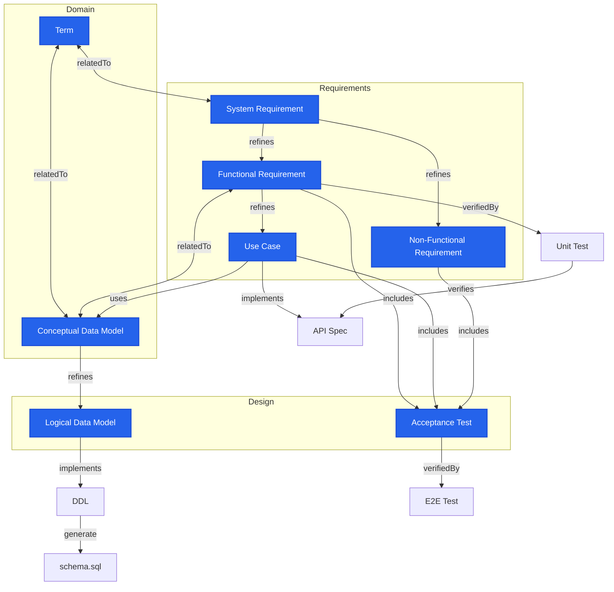

# speckeeper scaffold: Mermaid Input Specification

The `speckeeper scaffold` command takes a mermaid flowchart describing a specification metamodel as input and auto-generates skeleton code for `design/_models/` and spec data files.

This document defines the format, constraints, and vocabulary of the mermaid flowchart accepted by scaffold.

---

## 1. Overall Structure

A Markdown file processed by scaffold must contain one or more mermaid code blocks. scaffold processes the first `flowchart` block found.

    ```mermaid
    flowchart TB
      Node definitions
      Edge definitions
      classDef / class definitions
    ```

- The direction specifier (`TB`, `LR`, etc.) is optional and does not affect scaffold behavior.
- The `graph` keyword is treated equivalently to `flowchart`.
- Lines starting with `%%` are ignored as comments.

---

## 2. Node Definitions

### 2.1 Syntax

```
ID[Label]
```

| Element | Required | Description |
|---------|----------|-------------|
| `ID` | Required | Alphanumeric characters and underscores. Must start with a letter or underscore |
| `[Label]` | Optional | Display text enclosed in square brackets. May contain any characters. If omitted, the ID is used as the label |

### 2.2 Node Declaration Locations

Nodes may first appear within edge definitions. When the same ID appears multiple times, the first definition with a label takes precedence.

```
SR -->|refines| FR[Functional Requirement]   %% FR label defined here
FR -->|includes| AT[Acceptance Test]          %% FR already defined, label ignored
```

---

## 3. Subgraph Definitions

Subgraphs determine the model level (L0–L3) for all nodes contained within them. The level is inferred from the subgraph label using keyword matching (case-insensitive).

| Subgraph Label Pattern | Inferred Level |
|------------------------|----------------|
| `L0`, `Business`, `Domain` | L0 |
| `L1`, `Requirements` | L1 |
| `L2`, `Design`, `Architecture` | L2 |
| `L3`, `Implementation`, `External` | L3 |
| (no subgraph) | L0 (default) |

```
subgraph L0[Domain]
  TERM[Term]
  CDM[Conceptual Data Model]
end

subgraph L1[Requirements]
  SR[System Requirement]
  FR[Functional Requirement]
  NFR[Non-Functional Requirement]
  UC[Use Case]
end

subgraph L2[Design]
  LDM[Logical Data Model]
  AT[Acceptance Test]
end
```

Nested subgraphs are supported; the innermost subgraph determines the level.

---

## 4. Class Assignments

### 4.1 speckeeper-Managed Nodes

scaffold generates model files only for nodes explicitly declared as **speckeeper-managed** via `classDef` + `class`.

```
classDef speckeeper fill:#2563EB,stroke:#1D4ED8,color:#fff,stroke-width:2px
class TERM,SR,FR,NFR,CDM,UC,LDM,AT speckeeper
```

| Line | Required | Description |
|------|----------|-------------|
| `classDef speckeeper ...` | Required | CSS style definition. Style values are arbitrary |
| `class ID1,ID2,... speckeeper` | Required | Comma-separated list of speckeeper-managed node IDs |

- The class name must be `speckeeper`. scaffold filters by this class name.
- Nodes not listed in the `class` line are treated as "external nodes" and no model files are generated for them.

### 4.2 Artifact Class Assignment

In addition to the `speckeeper` class, nodes can be assigned an **artifact class** that determines how they are grouped into model files.

```
class FR,NFR requirement
class TERM term
class CDM,LDM entity
class SR systemRequirement
class UC useCase
class AT acceptanceTest
```

The artifact class controls three things:

1. **Model name**: PascalCase of the class name (e.g., `requirement` → `Requirement`)
2. **File name**: kebab-case of the class name (e.g., `acceptanceTest` → `acceptance-test.ts`)
3. **Node grouping**: Multiple nodes assigned the same class are consolidated into a single model file

Any class name is valid — there is no fixed registry. All artifact classes use the same base template (schema, lint rule stubs, exporter stubs).

If a speckeeper-managed node has no artifact class assigned, scaffold derives a default class from the node ID (lowercased).

### 4.3 External Node Classes

Classes assigned to external (non-speckeeper) nodes determine the checker factory used when `implements` or `verifiedBy` edges point to them.

| External Class | Checker Factory |
|----------------|-----------------|
| `openapi` | `externalOpenAPIChecker` |
| `sqlschema` | `externalSqlSchemaChecker` |
| `test` | `testChecker` |
| (no class) | Generic checker stub |

```
class API openapi
class DDL sqlschema
class UT,IT,E2ET test
```

---

## 5. Edge Definitions

### 5.1 Syntax

```
SourceID -->|Label| TargetID[Label]
SourceID <-->|Label| TargetID[Label]
```

| Arrow | Name | Direction |
|-------|------|-----------|
| `-->` | Unidirectional | forward |
| `<-->` | Bidirectional | bidirectional |
| `--->`, `---->` | Unidirectional (long) | forward |
| `<--->`, `<---->` | Bidirectional (long) | bidirectional |
| `-.->` | Dotted unidirectional | forward |
| `==>` | Thick unidirectional | forward |

Labels (`|...|`) are optional, but since scaffold determines the type of generated code based on labels, **labeling is strongly recommended**. Edges without labels are excluded from scaffold generation.

---

## 6. Edge Label Specification

### 6.1 Basic Rules

Labels on edges involving speckeeper-managed nodes (where at least one of source or target is speckeeper-managed) must be **strings matching speckeeper's `RELATION_TYPES`**.

Edges **between non-managed nodes only** may use any free-form label text.

### 6.2 Available Labels (= speckeeper RELATION_TYPES)

**Category A: Lint (speckeeper ↔ speckeeper reference integrity)**

| Label | Arrow | Description |
|-------|-------|-------------|
| `refines` | `-->` | Refines higher-level into lower-level. Lint checks reference existence + level constraint (source.level > target.level) |
| `relatedTo` | `<-->` | Bidirectional association. Lint checks bidirectional reference existence |
| `uses` | `-->` | Reference / dependency. Lint checks target existence |
| `dependsOn` | `-->` | Dependency. Lint checks target existence |
| `satisfies` | `-->` | Satisfies a requirement. Lint checks target existence |
| `includes` | `-->` | Parent contains child. Lint checks target existence |
| `traces` | `-->` | Derives target from source. Lint checks target existence |

**Category B: Check (speckeeper → external)**

| Label | Arrow | Description |
|-------|-------|-------------|
| `implements` | `-->` | Spec implemented as external artifact. Checker factory selected by the target node's class |
| `verifiedBy` | `-->` | Spec verified by external test code. Checker factory selected by the target node's class |

**Category C: External (no checker generated)**

| Label | Arrow | Description |
|-------|-------|-------------|
| `verifies` | `-->` | Test verifies implementation. Used between external nodes (external→external). No checker is generated |

### 6.3 Labels Between Non-Managed Nodes (Free Text)

Edges between non-managed nodes may use any labels. scaffold does not validate these edges.

Commonly used external labels:

| Label | Example Usage |
|-------|---------------|
| `generate` | Auto-generation by external tools |
| `apply` | Application to external systems |
| `deploy` | Deployment |

### 6.4 Label Normalization

For edges involving speckeeper-managed nodes, labels with modifiers are normalized using the following logic:

1. **Exact match**: Label matches a RelationType exactly (case-insensitive)
2. **Suffix match**: Label ends with a RelationType (longest match wins)
3. **Substring match**: Label contains a RelationType (longest match wins)
4. **Fallback**: If none of the above match, a warning is emitted and reference integrity lint is still applied

---

## 7. Checker Binding

When scaffold detects `implements` or `verifiedBy` edges from speckeeper-managed nodes to external nodes, it emits **checker binding guidance as comments** in the generated model file. No separate `_checkers/` directory is generated.

The checker factory is selected based on the external node's class (see Section 4.3):

| Edge | Target Class | Checker Factory |
|------|--------------|-----------------|
| `implements` | `openapi` | `externalOpenAPIChecker` |
| `implements` | `sqlschema` | `externalSqlSchemaChecker` |
| `verifiedBy` | `test` | `testChecker` |
| `implements` / `verifiedBy` | (unknown) | Generic checker stub |

Users activate the binding by importing the factory from `speckeeper/dsl` and assigning it to the model's `externalChecker` property.

---

## 8. scaffold Validation

At execution time, scaffold validates the mermaid diagram's consistency and emits diagnostic messages (warning/error).

| Rule | Severity | Condition |
|------|----------|-----------|
| Invalid label | warning | Edge label involving a speckeeper-managed node cannot be normalized to a RelationType |
| Arrow direction mismatch | warning | `relatedTo` written with `-->`, or `refines` etc. written with `<-->` |
| `implements` between speckeeper nodes | warning | `implements` used between speckeeper → speckeeper (recommend `refines` etc.) |
| `verifiedBy` between speckeeper nodes | warning | `verifiedBy` used between speckeeper → speckeeper (should target external test nodes) |
| No speckeeper-managed node declaration | error | No `class ... speckeeper` line exists |

Edges between non-managed nodes are not validated.

---

## 9. Generated Outputs

Files generated by scaffold:

| Path | Generation Condition | Content |
|------|---------------------|---------|
| `_models/<class>.ts` | Per artifact class (deduplicated) | Base model: schema, lint rule stubs (`requireField`), exporter stubs. Checker binding comments for `implements`/`verifiedBy` edges |
| `_models/index.ts` | Always | Re-exports all models + `allModels` array |
| `<class>.ts` | Per artifact class | Spec data file with `defineSpecs()` |
| `index.ts` | Always | Entry point with `mergeSpecs()` |

---

## 10. Complete Example



From this diagram, scaffold generates the following:

**_models/**
- `term.ts` — TERM (level: L0)
- `entity.ts` — CDM, LDM (levels: L0, L2)
- `system-requirement.ts` — SR (level: L1)
- `requirement.ts` — FR, NFR (level: L1). Contains checker binding comments for `implements → openapi` (via UC) and `verifiedBy → test` (UT)
- `use-case.ts` — UC (level: L1). Contains checker binding comments for `implements → openapi` (API)
- `acceptance-test.ts` — AT (level: L2). Contains checker binding comments for `verifiedBy → test` (E2ET)
- `index.ts`

**Spec data files:**
- `term.ts`, `entity.ts`, `system-requirement.ts`, `requirement.ts`, `use-case.ts`, `acceptance-test.ts` — each with `defineSpecs()` calls
- `index.ts` — entry point with `mergeSpecs()`

---

## 11. CLI Reference

```
speckeeper scaffold --source <path> [--output <dir>] [--force] [--dry-run]
```

| Option | Required | Default | Description |
|--------|----------|---------|-------------|
| `--source`, `-s` | Required | - | Path to the Markdown file containing a mermaid flowchart |
| `--output`, `-o` | Optional | `design/` | Output directory |
| `--force`, `-f` | Optional | false | Overwrite existing files |
| `--dry-run` | Optional | false | Print generated content to stdout without writing files |
