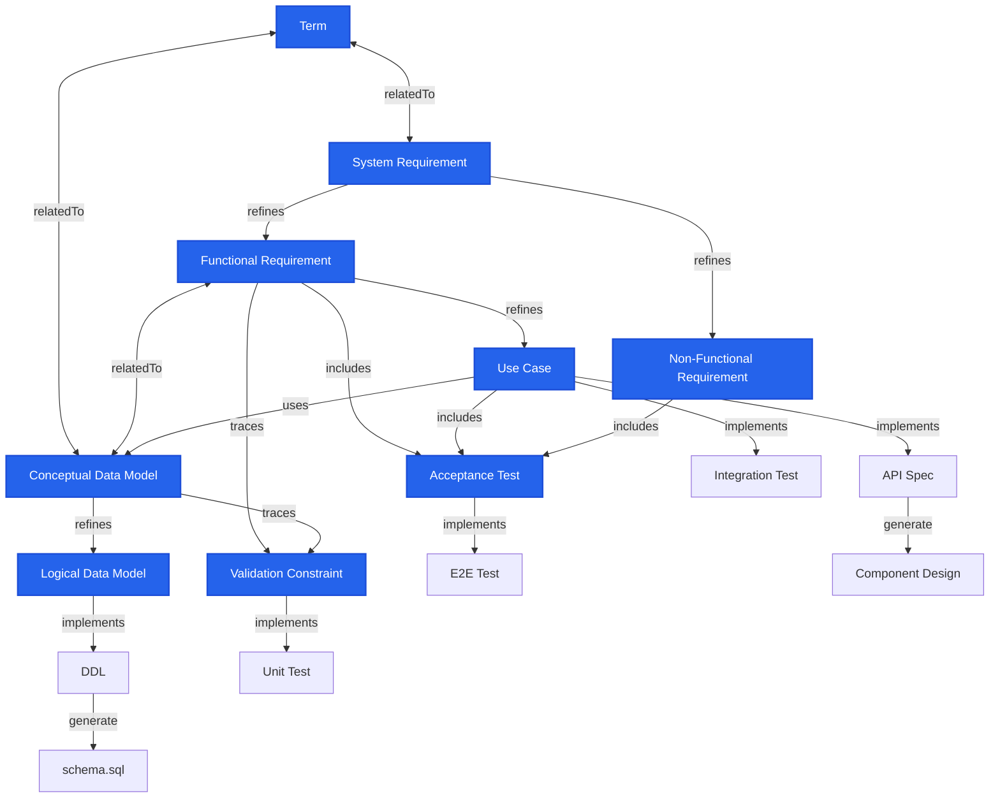

# speckeeper scaffold: Mermaid Input Specification

The `speckeeper scaffold` command takes a mermaid flowchart describing a specification metamodel as input and auto-generates skeleton code for `design/_models/` and `design/_checkers/`.

This document defines the format, constraints, and vocabulary of the mermaid flowchart accepted by scaffold.

---

## 1. Overall Structure

A Markdown file processed by scaffold must contain one or more mermaid code blocks. scaffold processes the first `flowchart` block found.

    ```mermaid
    flowchart TB
      Node definitions
      Edge definitions
      classDef / class definitions
    ```

- The direction specifier (`TB`, `LR`, etc.) is optional and does not affect scaffold behavior.
- The `graph` keyword is treated equivalently to `flowchart`.
- Lines starting with `%%` are ignored as comments.

---

## 2. Node Definitions

### 2.1 Syntax

```
ID[Label]
```

| Element | Required | Description |
|---------|----------|-------------|
| `ID` | Required | Alphanumeric characters and underscores. Must start with a letter or underscore |
| `[Label]` | Optional | Display text enclosed in square brackets. May contain any characters. If omitted, the ID is used as the label |

### 2.2 Node Declaration Locations

Nodes may first appear within edge definitions. When the same ID appears multiple times, the first definition with a label takes precedence.

```
SR -->|refines| FR[Functional Requirement]   %% FR label defined here
FR -->|includes| AT[Acceptance Test]          %% FR already defined, label ignored
```

### 2.3 Built-in Node IDs

The following node IDs are reserved IDs that scaffold maps to specific model templates.

| Node ID | Template | Model Name | ID Prefix | Level | Description |
|---------|----------|------------|-----------|-------|-------------|
| `TERM` | term | Term | TERM | L0 | Glossary term |
| `CDM` | entity | ConceptualDataModel | CDM | L0 | Conceptual data model |
| `SR` | requirement | SystemRequirement | SR | L1 | System requirement |
| `FR` | requirement | FunctionalRequirement | FR | L1 | Functional requirement |
| `NFR` | requirement | NonFunctionalRequirement | NFR | L1 | Non-functional requirement |
| `UC` | usecase | UseCase | UC | L1 | Use case |
| `LDM` | logical-entity | LogicalDataModel | LDM | L2 | Logical data model |
| `AT` | acceptance-test | AcceptanceTest | AT | L2 | Acceptance test |
| `DT` | data-test | DataTest | DT | L2 | Data integrity test specification |
| `VC` | validation-constraint | ValidationConstraint | VC | L2 | Validation constraint |

Node IDs that map to the same template (e.g., SR, FR, NFR -> requirement) are consolidated into a single model file containing multiple Model classes.

Node IDs not matching any built-in ID fall back to the `base` template (minimal structure with id, name, description, and relations only).

---

## 3. speckeeper-Managed Node Declaration

scaffold generates `_models/*.ts` files only for nodes explicitly declared as **speckeeper-managed** via `classDef` + `class`.

### 3.1 Syntax

```
classDef speckeeper fill:#2563EB,stroke:#1D4ED8,color:#fff,stroke-width:2px
class TERM,SR,FR,NFR,CDM,UC,LDM,AT,DT,VC speckeeper
```

| Line | Required | Description |
|------|----------|-------------|
| `classDef speckeeper ...` | Required | CSS style definition. Style values are arbitrary |
| `class ID1,ID2,... speckeeper` | Required | Comma-separated list of speckeeper-managed node IDs |

- The class name must be `speckeeper`. scaffold filters by this class name.
- Nodes not listed in the `class` line are treated as "external nodes" and no model files are generated for them.
- If edges exist to external nodes, checker files are generated based on the edge labels.

---

## 4. Edge Definitions

### 4.1 Syntax

```
SourceID -->|Label| TargetID[Label]
SourceID <-->|Label| TargetID[Label]
```

| Arrow | Name | Direction |
|-------|------|-----------|
| `-->` | Unidirectional | forward |
| `<-->` | Bidirectional | bidirectional |
| `--->`, `---->` | Unidirectional (long) | forward |
| `<--->`, `<---->` | Bidirectional (long) | bidirectional |
| `-.->` | Dotted unidirectional | forward |
| `==>` | Thick unidirectional | forward |

Labels (`|...|`) are optional, but since scaffold determines the type of generated code based on labels, **labeling is strongly recommended**. Edges without labels are excluded from scaffold generation.

---

## 5. Edge Label Specification

### 5.1 Basic Rules

Labels on edges involving speckeeper-managed nodes (where at least one of source or target is speckeeper-managed) must be **strings matching speckeeper's `RELATION_TYPES`**.

Edges **between non-managed nodes only** may use any free-form label text.

### 5.2 Available Labels (= speckeeper RELATION_TYPES)

The 7 labels available for edges involving speckeeper-managed nodes and the corresponding code scaffold generates:

**Category A: speckeeper lint targets (speckeeper <-> speckeeper reference integrity)**

| Label | Arrow | scaffold generates | Description |
|-------|-------|--------------------|-------------|
| `refines` | `-->` | lintRule (reference existence + level constraint check) | Refines a higher-level item into lower-level detail |
| `relatedTo` | `<-->` | lintRule (bidirectional reference existence check) | Bidirectional association / consistency constraint |
| `uses` | `-->` | lintRule (referenced target existence check) | Reference / dependency relationship |
| `dependsOn` | `-->` | lintRule (dependency target existence check) | Dependency relationship |
| `satisfies` | `-->` | lintRule (satisfaction target existence check) | Business / requirement satisfaction |

**Category B: speckeeper check targets (speckeeper -> external node)**

| Label | Arrow | scaffold generates | Description |
|-------|-------|--------------------|-------------|
| `implements` | `-->` | ExternalChecker or coverageChecker | Implements a speckeeper spec as an external artifact / interface / test |

- If the target is a test-related external node -> generates coverageChecker (`check test --coverage`)
- If the target is an artifact-related external node -> generates ExternalChecker in `_checkers/`

**Category C: speckeeper check --coverage targets (speckeeper -> speckeeper)**

| Label | Arrow | scaffold generates | Description |
|-------|-------|--------------------|-------------|
| `includes` | `-->` | coverageChecker (containment coverage) | Parent includes child |
| `traces` | `-->` | coverageChecker (derivation tracing) | Derives target from source |
| `verifies` | `-->` | coverageChecker (test coverage) | Test verifies target |

**Test-related node detection:** A node is classified as test-related if its ID is one of `UT`, `IT`, `DUT`, `E2ET`, or the ID contains `TEST`, or the label contains "test" (case-insensitive).

### 5.3 Labels Between Non-Managed Nodes (Free Text)

Edges between non-managed nodes may use any labels. scaffold does not validate these edges.

Commonly used external labels:

| Label | Example Usage |
|-------|---------------|
| `generate` | Auto-generation by external tools (drift check target) |
| `apply` | Application to external systems |
| `deploy` | Deployment |

### 5.4 Label Normalization

For edges involving speckeeper-managed nodes, labels with modifiers are normalized using the following logic:

1. **Exact match**: Label matches a RelationType exactly (case-insensitive)
2. **Suffix match**: Label ends with a RelationType (longest match wins)
3. **Substring match**: Label contains a RelationType (longest match wins)
4. **Fallback**: If none of the above match, a warning is emitted and the label is treated as `relatedTo`

---

## 6. Checker Template Mapping

For `implements` edges from speckeeper-managed nodes to external nodes, a checker template is applied based on the target node ID.

**Artifact Checkers (ExternalChecker):**

| Target Node ID | Checker Template | targetType | Validation |
|----------------|------------------|------------|------------|
| `DDL` | ddl-checker | ddl | Verifies that tables/columns corresponding to logical entities exist in schema.sql |
| `API` | openapi-checker | openapi | Verifies that endpoints corresponding to use cases exist in the OpenAPI specification |

**Test Checkers (test-checker):**

| Target Node ID | Checker Filename | targetType | Validation |
|----------------|------------------|------------|------------|
| `E2ET` | e2e-test-checker | test | Verifies that test files exist and reference spec IDs |
| `UT` | unit-test-checker | test | Verifies that test files exist and reference spec IDs |
| `DUT` | data-unit-test-checker | test | Verifies that test files exist and reference spec IDs |
| `IT` | integration-test-checker | test | Verifies that test files exist and reference spec IDs |

test-checker validates:
1. Test code files exist at the designated paths
2. Spec IDs are referenced within test code (inside describe/it/test blocks, or via embedoc markers)

**Other:**

| Target Node ID | Checker Template | targetType |
|----------------|------------------|------------|
| Any other | base-checker (generic skeleton) | Lowercase node ID |

---

## 7. scaffold Validation

At execution time, scaffold validates the mermaid diagram's consistency and emits diagnostic messages (warning/error).

| Rule | Severity | Condition |
|------|----------|-----------|
| Invalid label | warning | Edge label involving a speckeeper-managed node cannot be normalized to a RelationType |
| Arrow direction mismatch | warning | `relatedTo` written with `-->`, or `refines` etc. written with `<-->` |
| `implements` between speckeeper nodes | warning | `implements` used between speckeeper -> speckeeper (recommend `refines` etc.) |
| `includes`/`traces` with external node | warning | Used between speckeeper -> external or external -> speckeeper |
| No speckeeper-managed node declaration | error | No `class ... speckeeper` line exists |

Edges between non-managed nodes are not validated.

---

## 8. Generated Outputs

Files generated by scaffold:

| Path | Generation Condition | Content |
|------|---------------------|---------|
| `_models/<template>.ts` | Per speckeeper-managed node (deduplicated by template) | Model class, Zod schema, LintRule, Exporter |
| `_models/index.ts` | Always generated | Re-export of all models + `allModels` array |
| `_checkers/<target>-checker.ts` | Per `implements` edge to external artifact (deduplicated by target) | ExternalChecker skeleton |

---

## 9. Complete Example



From this diagram, scaffold generates the following:

**_models/**
- `term.ts` (TERM)
- `requirement.ts` (SR, FR, NFR)
- `entity.ts` (CDM)
- `usecase.ts` (UC)
- `logical-entity.ts` (LDM)
- `acceptance-test.ts` (AT)
- `data-test.ts` (DT)
- `validation-constraint.ts` (VC)
- `index.ts`

**_checkers/**
- `openapi-checker.ts` (UC ->|implements| API)
- `ddl-checker.ts` (LDM ->|implements| DDL)

`AT ->|implements| E2ET` and `UC ->|implements| IT` target test-related nodes, so they are configured as coverageCheckers within the model rather than ExternalCheckers.

---

## 10. CLI Reference

```
speckeeper scaffold --source <path> [--output <dir>] [--force] [--dry-run]
```

| Option | Required | Default | Description |
|--------|----------|---------|-------------|
| `--source`, `-s` | Required | - | Path to the Markdown file containing a mermaid flowchart |
| `--output`, `-o` | Optional | `design/` | Output directory |
| `--force`, `-f` | Optional | false | Overwrite existing files |
| `--dry-run` | Optional | false | Print generated content to stdout without writing files |
