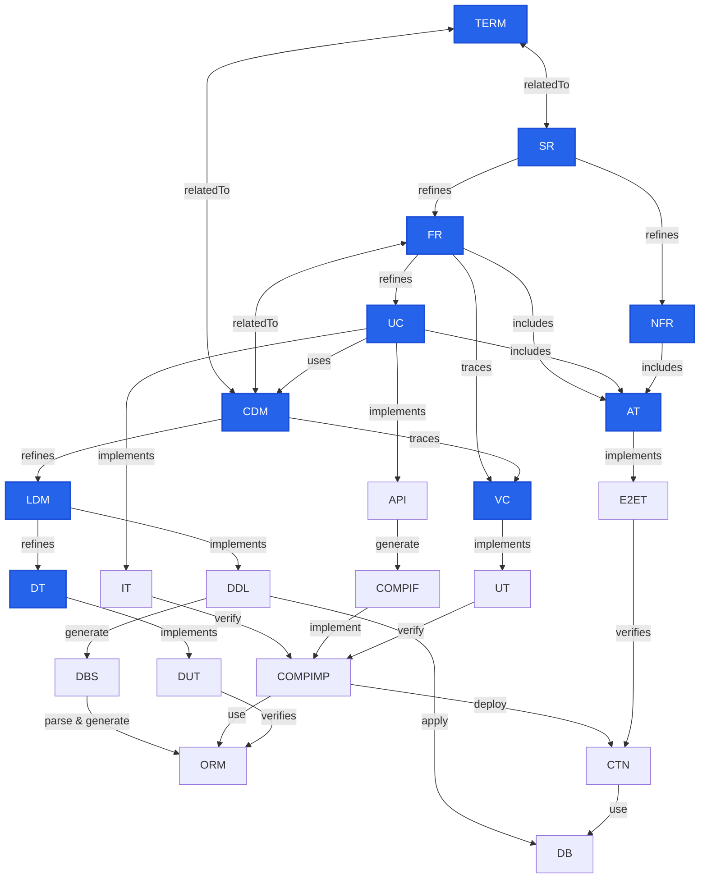

# Test fixture: scaffold integration test flowchart

```mermaid
flowchart TB
  TERM <--->|relatedTo| SR
  SR -->|refines| FR
  SR -->|refines| NFR

  TERM <-->|relatedTo| CDM
  FR -->|refines| UC
  FR <-->|relatedTo| CDM
  UC -->|uses| CDM

  UC -->|implements| API
  CDM -->|refines| LDM
  LDM -->|implements| DDL
  LDM -->|refines| DT
  DT -->|implements| DUT
  DDL -->|generate| DBS
  DDL -->|apply| DB
  DBS -->|parse & generate| ORM

  UC -->|implements| IT

  IT -->|verify| COMPIMP
  API -->|generate| COMPIF
  COMPIF -->|implement| COMPIMP
  COMPIMP -->|use| ORM
  UT -->|verify| COMPIMP
  COMPIMP -->|deploy| CTN
  CTN -->|use| DB

  FR -->|includes| AT
  UC -->|includes| AT
  NFR -->|includes| AT
  FR -->|traces| VC
  CDM -->|traces| VC
  VC -->|implements| UT
  DUT -->|verifies| ORM
  E2ET -->|verifies| CTN
  AT -->|implements| E2ET

  classDef speckeeper fill:#2563EB,stroke:#1D4ED8,color:#fff,stroke-width:2px
  class TERM,SR,FR,NFR,CDM,UC,LDM,AT,DT,VC speckeeper
```
